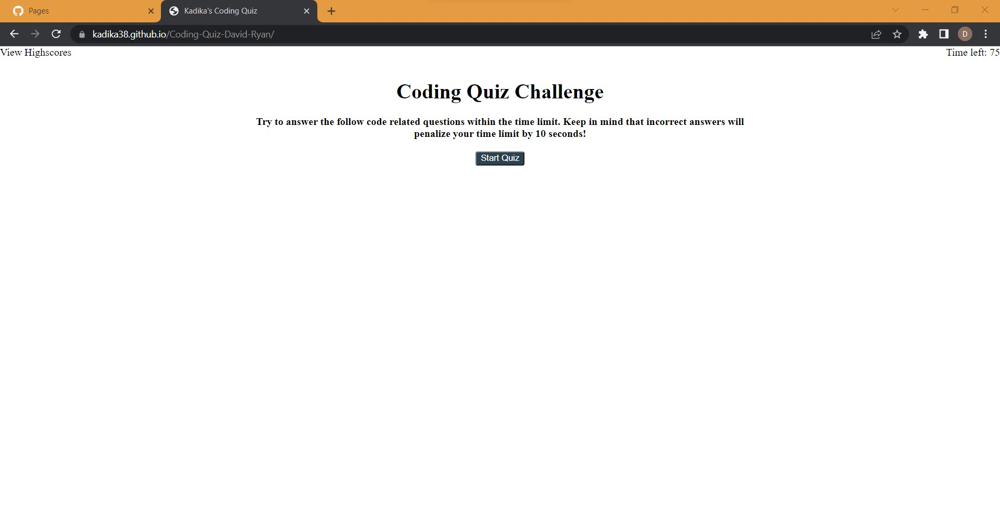

# <Coding-Quiz-David-Ryan>
Bootcamp Homework 04 Coding Quiz:
A short coding quiz using dynamically updated html and css powered by javascript.

## Description

This is a simple coding quiz.  When the user loads the page, they see a title and description of the quiz and a start quiz button.  At the top left they see View Highscores, and at the top right they see the time left and the number 75.

When the user clicks the start quiz button, the page replaces the title, description, and start button with a question and four multiple choice options as buttons.  The timer will start counting down from 75.  When the user clicks an answer, the next question is generated and a small dialogue below the question tells the user whether they answered correctly or not.  If they answered incorrectly, the time left will be reduced by 10 seconds as a penalty.

When the user either answers the final question or runs out of time, the quiz ends and the user is given the ability to enter their initials to go with their score.  When the user clicks submit on this screen, they are shown the highscores scoreboard.  This scoreboard is populated from the local storage and will include any previous scores as well.  This could also be loaded at any time by clicking View Highscores in the top left.  The user has the option to clear the scoreboard (which will also clear it from local storage) as well as to go baack to the starting page of the quiz.

The quiz can be taken as many times as the user wants.  The timer will reset each time.

## Screenshot

## Link to Deployed Website

https://kadika38.github.io/Coding-Quiz-David-Ryan/